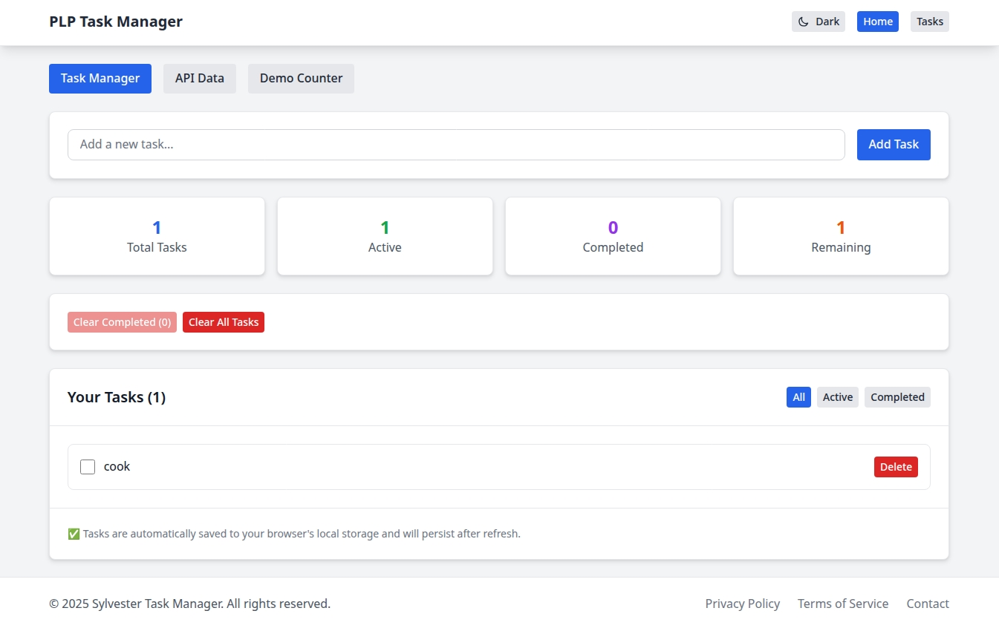
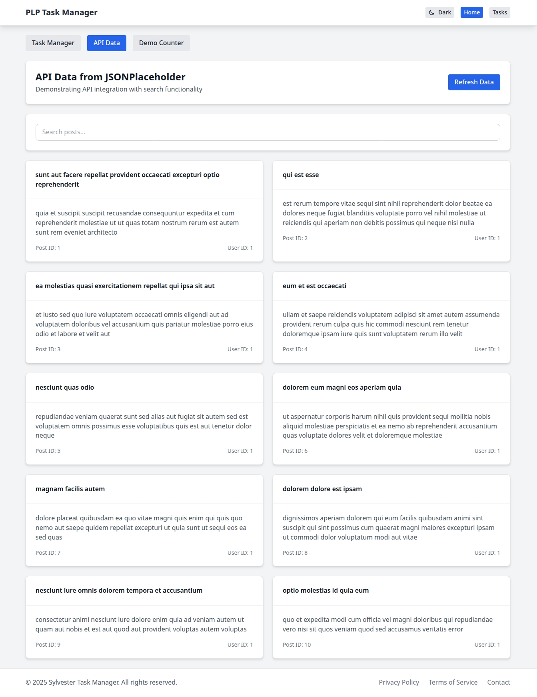
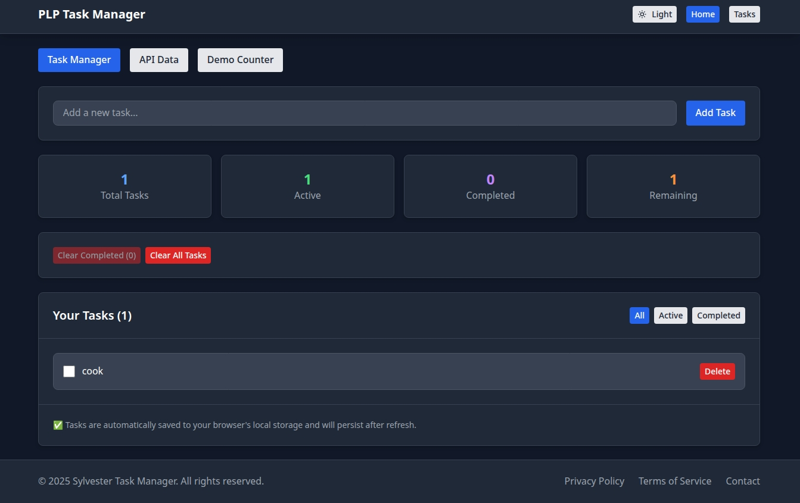

# Sylvester Task Manager - React Application

A modern, responsive React task management application built with Vite, Tailwind CSS, and React Hooks. This application demonstrates component architecture, state management, API integration, and responsive design.

## 🚀 Features

### ✅ Task Management
- **Add, Edit, Delete Tasks** - Full CRUD operations for task management
- **Task Filtering** - Filter tasks by All, Active, or Completed status
- **Local Storage** - Tasks persist in browser localStorage
- **Task Statistics** - Real-time stats showing total, active, completed, and remaining tasks
- **Interactive UI** - Smooth animations and transitions

### 🌐 API Integration
- **JSONPlaceholder Integration** - Fetch and display posts from public API
- **Search Functionality** - Real-time search through API data
- **Loading States** - Elegant loading indicators
- **Error Handling** - Comprehensive error states and messages
- **Responsive Data Display** - Card-based layout for API data

### 🎨 Modern UI/UX
- **Responsive Design** - Works seamlessly on mobile, tablet, and desktop
- **Dark/Light Mode** - Toggle between themes (uses system preference)
- **Tailwind CSS** - Utility-first CSS framework for rapid UI development
- **Component Architecture** - Reusable and maintainable components
- **Interactive Elements** - Hover effects, transitions, and animations

### ⚛️ React Features
- **React Hooks** - useState, useEffect for state management
- **Component Composition** - Modular and reusable components
- **Prop Validation** - PropTypes for component type checking
- **Event Handling** - Comprehensive user interaction management


## 📸 Screenshots

### Task Manager Interface


### API Data Display  


### Dark Mode


## Deployed live in github at 
[https://plp-mern-stack-development.github.io/react-js-jsx-and-css-mastering-front-end-development-Dubleu-x/]


## 🛠️ Technology Stack

- **Frontend Framework**: React 18
- **Build Tool**: Vite
- **Styling**: Tailwind CSS
- **Routing**: React Router DOM
- **State Management**: React Hooks (useState, useEffect)
- **API Client**: Native Fetch API
- **Icons**: Heroicons (via SVG)
- **Development**: ESLint, Hot Module Replacement

## 📦 Project Structure

```
src/
├── components/
│   ├── Button.jsx          # Reusable button with variants
│   ├── Navbar.jsx          # Navigation header
│   ├── Footer.jsx          # Application footer
│   ├── Card.jsx            # Card container component
│   ├── TaskManager.jsx     # Main task management logic
│   └── ApiData.jsx         # API integration component
├── App.jsx                 # Main application component
├── App.css                 # Global styles and Tailwind imports
└── main.jsx                # Application entry point
|---screenshot
            
```

## 🏁 Getting Started

### Prerequisites

- Node.js (v18 or higher recommended)
- npm or yarn package manager

### Installation

1. **Clone the repository**
   ```bash
   git clone <repository-url>
   cd react-task-manager
   ```

2. **Install dependencies**
   ```bash
   npm install
   ```

3. **Start the development server**
   ```bash
   npm run dev
   ```

4. **Open your browser**
   Navigate to `http://localhost:5173`

### Available Scripts

- `npm run dev` - Start development server
- `npm run build` - Build for production
- `npm run preview` - Preview production build
- `npm run lint` - Run ESLint

## 🎯 Component Documentation

### Button Component
```jsx
<Button 
  variant="primary|secondary|danger|success|warning"
  size="sm|md|lg"
  disabled={true|false}
  onClick={handleClick}
>
  Click Me
</Button>
```

### Card Component
```jsx
<Card hover={true}>
  <CardHeader>Title</CardHeader>
  <CardBody>Content</CardBody>
  <CardFooter>Actions</CardFooter>
</Card>
```

### TaskManager Component
- Manages task state with localStorage persistence
- Provides filtering (All, Active, Completed)
- Implements task statistics
- Handles task creation, completion, and deletion

### ApiData Component
- Fetches data from JSONPlaceholder API
- Implements search functionality
- Handles loading and error states
- Displays data in responsive card layout

## 🔧 Key Features Implementation

### State Management
```jsx
// Task state with localStorage persistence
const [tasks, setTasks] = useState([]);
useEffect(() => {
  const savedTasks = localStorage.getItem('plp-tasks');
  if (savedTasks) setTasks(JSON.parse(savedTasks));
}, []);

useEffect(() => {
  localStorage.setItem('plp-tasks', JSON.stringify(tasks));
}, [tasks]);
```

### API Integration
```jsx
const fetchData = async () => {
  setLoading(true);
  try {
    const response = await fetch('https://jsonplaceholder.typicode.com/posts');
    const data = await response.json();
    setPosts(data.slice(0, 10));
  } catch (err) {
    setError(err.message);
  } finally {
    setLoading(false);
  }
};
```

### Responsive Design
- Mobile-first approach with Tailwind CSS
- Flexbox and Grid layouts
- Responsive breakpoints (sm, md, lg, xl)
- Adaptive component sizing

## 🎨 Styling & Theming

### Tailwind CSS Configuration
- Custom color palette
- Dark mode support
- Custom animations and transitions
- Responsive utility classes

### Custom Components
- Reusable button variants
- Card component with header/body/footer
- Consistent spacing and typography
- Accessible color contrasts

## 📱 Responsive Breakpoints

- **Mobile**: < 768px
- **Tablet**: 768px - 1024px
- **Desktop**: > 1024px

## 🔮 Future Enhancements

- [ ] User authentication
- [ ] Backend integration
- [ ] Task categories and tags
- [ ] Due dates and reminders
- [ ] Drag and drop task ordering
- [ ] Export tasks functionality
- [ ] PWA capabilities
- [ ] Unit and integration tests

## 🤝 Contributing

1. Fork the repository
2. Create a feature branch (`git checkout -b feature/amazing-feature`)
3. Commit your changes (`git commit -m 'Add some amazing feature'`)
4. Push to the branch (`git push origin feature/amazing-feature`)
5. Open a Pull Request

## 📄 License

This project is licensed under the MIT License - see the [LICENSE](LICENSE) file for details.

## 👥 Authors

- Sylvester Kamau - [GitHub](https://github.com/Dubleu-x)

## 🙏 Acknowledgments

- React team for the amazing framework
- Vite team for the fast build tool
- Tailwind CSS for the utility-first CSS framework
- JSONPlaceholder for the free fake API
- PLP Academy for the learning opportunity

## 📞 Support

If you have any questions or run into issues, please:

1. Check the [Issues](../../issues) page
2. Create a new issue with detailed description
3. Contact the development team

---

**Built with ❤️ using React and Tailwind CSS**